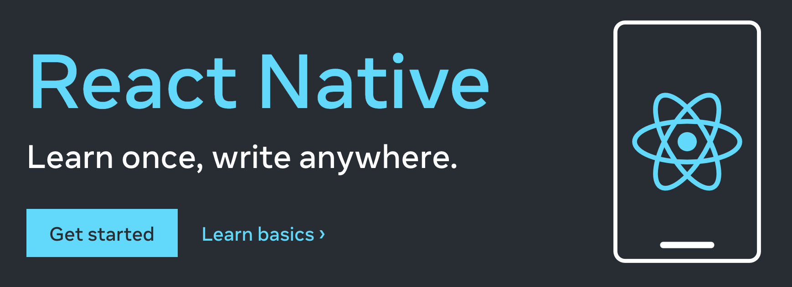

# S4 08 React Native (Full time)

🛠 El proyecto a desarrollar consiste en una app de conexion entre una organizacion y grupos de developers

## Tecnologías

- 💻 Frontend (React Native, Typescript)
- ⚙ Backend (Node Js y Express) desplegado en Heroku
- 💾 Base de datos (MongoDB)

## Puntos de la App

- [ ] El developer puede registrarse
- [ ] Al developer se le asigna un equipo
- [ ] El developer puede ver informacion acerca de su equipo
- [ ] El developer recibe notificacion con informacion del cliente/organizacion que quiera trabajar con su equipo
- [ ] El cliente/organizacion puede registrarse
- [ ] El cliente/organizacion puede ver los grupos de developers
- [ ] El cliente/organizacion puede filtrar los grupos segun su requerimiento
- [ ] El cliente/organizacion puede contactar al grupo de developers que le interese

## Demo

https://user-images.githubusercontent.com/91083824/197594621-9b701330-4580-4d60-8d34-21772a7ce063.mp4

https://user-images.githubusercontent.com/91083824/197594645-3e81f63d-3823-467c-97f0-2e8f644f1ed8.mp4

## Integrantes

* Abel Amieva (Front-end)
* Francisco Nanoia (Back-end)
* Nahuel Fanego Paz (Front-end)
